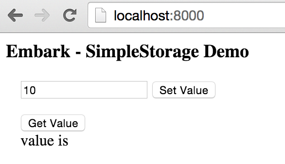

# Ethereum Toolbox

## Docker images for Ethereum

Docker images are available on the Docker Hub

* [jlrigau/geth](https://registry.hub.docker.com/u/jlrigau/geth/)
* [jlrigau/embark](https://registry.hub.docker.com/u/jlrigau/embark/)

## Embark

Framework for Ethereum DApps

Documentation on Embark framework is available here https://iurimatias.github.io/embark-framework/

### Run the Demo

Create Demo application

```shell
$docker run --name demo -d -v /dapp:/dapp jlrigau/embark demo
```

Run the blockchain

```shell
$docker run --name blockchain -d --volumes-from demo -w /dapp/embark_demo --net host jlrigau/embark blockchain
```

Check logs and wait the completion of DAG generation

```shell
$docker logs -f blockchain

...

Generating DAG for epoch 0 (0000000000000000000000000000000000000000000000000000000000000000)
Still generating DAG: 0%

...

Still generating DAG: 100%
Done generating DAG for epoch 0, it took 9m16.849571169s
```

Run the server

```shell
$docker run --name server -d --volumes-from demo -w /dapp/embark_demo --net container:blockchain jlrigau/embark run
```

Now you can access to the demonstration application through the URL ```localhost:8000```



### Creating a new DApp

Create a new application

```shell
$docker run --name AppName -d -v /dapp:/dapp jlrigau/embark new AppName
```

Run the blockchain

```shell
$docker run --name blockchain -d --volumes-from AppName -w /dapp/AppName --net host jlrigau/embark blockchain
```

Check logs and wait the completion of DAG generation

```shell
$docker logs -f blockchain

...

Generating DAG for epoch 0 (0000000000000000000000000000000000000000000000000000000000000000)
Still generating DAG: 0%

...

Still generating DAG: 100%
Done generating DAG for epoch 0, it took 9m16.849571169s
```

Run the server

```shell
$docker run --name server -d --volumes-from AppName -w /dapp/AppName --net container:blockchain jlrigau/embark run
```
